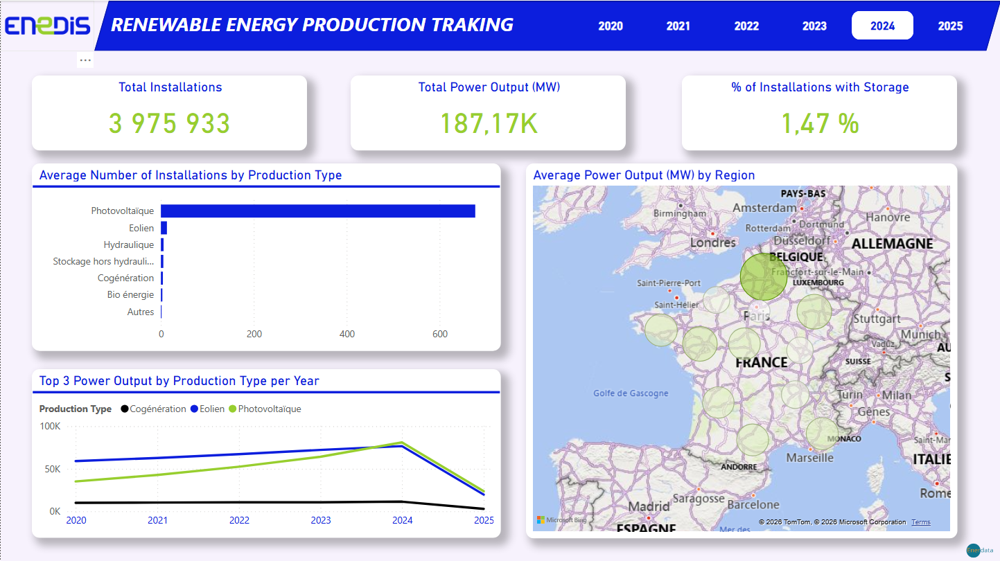
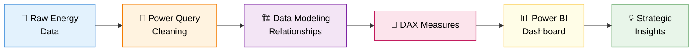

# ⚡ ENEDIS
### Renewable Energy Analytics Dashboard

*Exploring renewable energy production across France through interactive analytics*

---

## 📑 Table of Contents

- [Overview](#-overview)
- [Project Objectives](#-project-objectives)
- [Tech Stack](#️-tech-stack)
- [ETL Workflow](#-etl-workflow)
- [Data Preparation](#-data-preparation-power-query)
- [Dashboard Views](#-dashboard-views)
- [Key Insights](#-key-insights)
- [Skills Demonstrated](#-skills-demonstrated)
- [Conclusion](#-conclusion)

---

## 🎯 Overview

This project analyzes **renewable energy production across France** and surrounding regions through an interactive **Power BI dashboard**.

The objective is to explore energy generation patterns, regional disparities, and the influence of climate conditions on solar energy performance.

> **Three analytical dimensions explored**
> - 🔋 Energy production distribution
> - 🗺️ Regional and departmental performance
> - 🌤️ Climate impact on solar efficiency

---

## 📊 Dashboard Preview

This dashboard provides a comprehensive view of renewable energy production and regional performance across France.

---

## 🧭 Project Objectives

The goal is to demonstrate strong **data analysis and visualization skills** by transforming raw energy data into actionable insights.

| Objective | Capability Demonstrated |
|-----------|------------------------|
| 🧹 **Data Cleaning** | Structure complex datasets |
| 🏗️ **Data Modeling** | Build relational analytical models |
| 📊 **Dashboarding** | Design interactive visualizations |
| 💡 **Insight Extraction** | Surface meaningful business patterns |

---

## 🛠️ Tech Stack

| Layer | Tool | Purpose |
|-------|------|---------|
| **ETL** | `Power Query` | Data cleaning & transformation |
| **Modeling** | `Power BI Data Model` | Relationships & calculated columns |
| **Visualization** | `Power BI` | Interactive dashboards |
| **Calculations** | `DAX` | Measures & analytical logic |

---

## 🔄 ETL Workflow

---

## 🧹 Data Preparation (Power Query)

All data transformation and preparation were performed using **Power Query** within Power BI.

| Step | Action |
|------|--------|
| 1️⃣ | Data cleaning and formatting |
| 2️⃣ | Handling missing and inconsistent values |
| 3️⃣ | Standardization of regional and departmental names |
| 4️⃣ | Creation of calculated columns for analysis |
| 5️⃣ | Building relationships between datasets for proper modeling |

---

## 📊 Dashboard Views

### 🔋 Renewable Energy Production Tracking

| KPI | Value |
|-----|:-----:|
| 🏭 **Total Installations** | `~4 million` |
| ⚡ **Total Power Output (MW)** | Tracked |
| 🔋 **Storage Adoption** | `1.47%` |

- 🌬️ Energy mix distribution (Photovoltaic, Wind, Hydro, Cogeneration, etc.)
- 🗺️ Geographic distribution of production across regions

---

### 🌤️ Climate & Solar Performance

- 🌡️ **Average temperature** by region
- ☀️ **Sunshine duration** analysis per region
- 📐 **Theoretical solar yield** comparison across regions
- 🔗 Relationship between climate conditions and solar production efficiency

---

### 🗺️ Regional Energy Analysis

- 🏙️ Focus on **Île-de-France** region
- 🏆 **Top departments** by number of installations
- ⚡ **Power output distribution** by department
- 🔄 **Energy production breakdown** by type

---

## 💡 Key Insights

| # | Insight | Strategic Implication |
|---|---------|----------------------|
| 1 | **Photovoltaic** is the dominant renewable source | Continued investment justified |
| 2 | Solar production strongly correlated with **regional sunshine** | Site selection drives ROI |
| 3 | Energy generation **unevenly distributed** across regions | Regional strategies needed |
| 4 | Some regions significantly **outperform** in theoretical yield | Targeted development opportunities |
| 5 | Storage adoption remains **extremely limited (1.47%)** | Major infrastructure gap to address |

---

## 🎓 Skills Demonstrated

- 🧹 **ETL & data cleaning** with Power Query
- 🏗️ **Analytical data modeling** (relationships, calculated columns)
- 📊 **Dashboard design** & user-centric visualization
- 📐 **DAX measures** for advanced calculations
- 💡 **Storytelling with data** — translating raw datasets into decisions

---

## 🏁 Conclusion

This analysis provides a **clear understanding of renewable energy distribution** across France and highlights the importance of **climate conditions** in solar energy performance.

It also emphasizes:
- 🌍 **Regional disparities** in energy production
- ☀️ The growing role of **photovoltaic energy** in the renewable sector
- 🔋 The urgent need to develop **storage infrastructure** at scale

The dashboard transforms a complex energy dataset into a **strategic decision-support tool** for stakeholders in the renewable energy sector.

---

⭐ *If you found this project useful, feel free to star the repo!*

**Made with ⚡ by Tony Aires**

